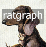
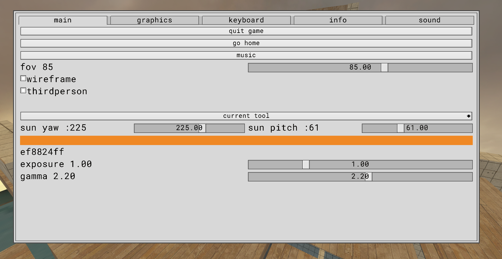

# ratgraph

graphics.zig.ImmediateDrawingContext provides a raylib style immediate drawing api.

gui_app.zig.Os9Gui provides a imgui.

## Depends on
* [zalgebra](https://github.com/kooparse/zalgebra)
* [stb](https://github.com/nothings/stb)
* [libsbng](https://github.com/randy408/libspng)
* [freetype](https://freetype.org/)
* [remix icon](https://github.com/Remix-Design/RemixIcon)
* [Roboto font](https://fonts.google.com/specimen/Roboto)
* [libepoxy](https://github.com/anholt/libepoxy)
* [sdl3](https://www.libsdl.org/)

